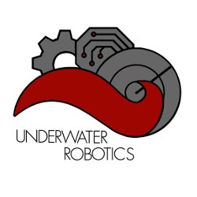

## The Riptide AUV Software Platform   

This repository is the main codebase for the Underwater Robotics Team at The Ohio State University. Our mission is to develop the software which powers our Autonomous Underwater Vehicles. The software in this repository handles low level controls, computer vision, mission-specific programs, and everything in between. All built on the Robot Operating System framework.

**The Underwater Robotics Team**  
The Ohio State University

[Website](https://uwrt.engineering.osu.edu) | [RoboSub](https://www.auvsifoundation.org/competition/robosub) | [License](LICENSE)

