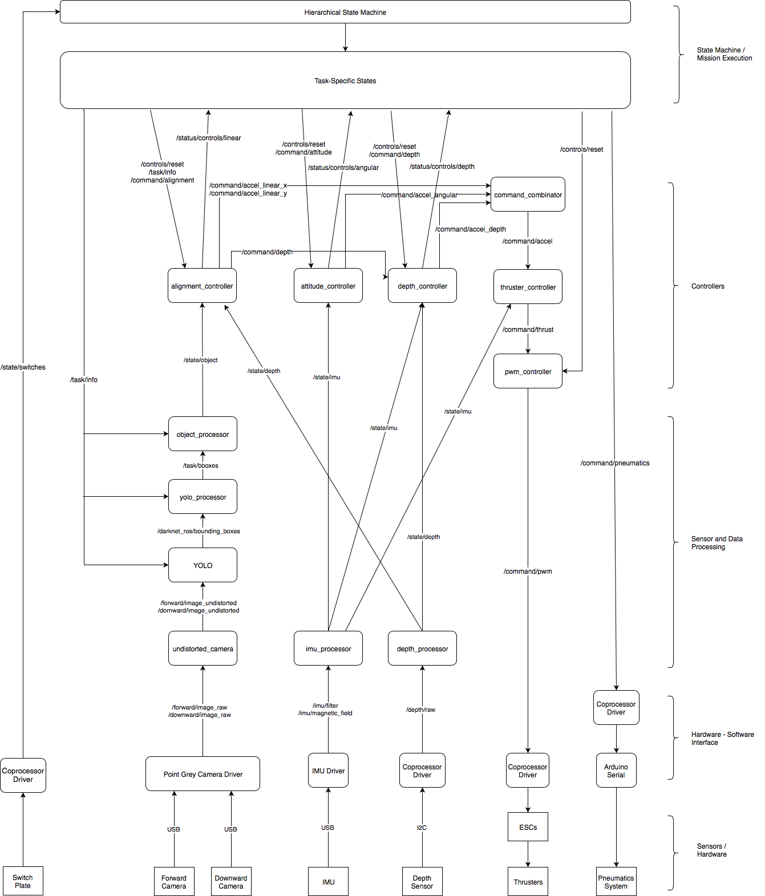

# Riptide Software

## The Riptide AUV Software Platform

This repository is the main codebase for the Underwater Robotics Team at The Ohio State University. Our mission is to develop the software which powers our autonomous underwater vehicles \(AUVs\) that compete in the Association for Unmanned Vehicle Systems International \(AUVSI\) [RoboSub](https://robonation.org/programs/robosub/) Competition in San Diego, CA. The software in this repository is built on [Robot Operating System](http://www.ros.org/) and handles low level controls, computer vision, mission-specific programs, and everything in between.

Supported Operating Systems: Ubuntu 16.04

**The Underwater Robotics Team**  
The Ohio State University

[Website](https://uwrt.engineering.osu.edu) \| [License](https://github.com/osu-uwrt/riptide_software/tree/fac98cfa750df74dbb107f83064c3767e6346cc4/LICENSE/README.md)


## Initial Setup

### Cloning riptide\_software

To collaborate with the `riptide_software` platform, you must fork this repo \(click "Fork" at the top-right of this page\). When executing the commands below, you will need to enter the URL to your forked repo. From YOUR forked repo, click "Clone or download" at the top-right of the page, copy the URL, and then insert that URL in place of `<your_forked_repo>`. Do NOT forget the `src` at the end of the last line. This is a catkin-specific requirement that all source code be placed within a folder called `src`

NOTE: It is common to see brackets such as `<>` to act as placeholders for actual code. Make sure you replace the ENTIRE phrase `<your_forked_repo>` with the URL.

```text
mkdir -p ~/osu-uwrt/riptide_software/
cd ~/osu-uwrt/
git clone <your_forked_repo> repos
```

### Setting up Git Remotes

Since you just cloned your fork to your computer, your remote called `origin` will point to your fork. Now, create a new remote called `upstream` that points to this main repo.

```text
cd ~/osu-uwrt/repos
git remote add upstream https://github.com/osu-uwrt/riptide_software.git
```

Now, if you type:

```text
git remote -v
```

You will see both a remote to your fork and to the main repo. You will use these two remotes a lot when pushing code to your fork, submitting pull-requests, and pulling the latest code.

### Installing ROS and/or Dependencies

The `riptide_software` base currently uses ROS Kinetic Kame and is dependent on various ROS packages and other libraries. In an effort to stop dependency issues,
we have moved to docker for workspace management. Use the [docker docs](https://docs.docker.com/install/linux/docker-ce/ubuntu/) to install docker-ce to prep for the environment. After you have docker installed, all you need to do is run:
```
./setup

```

## Docker

Docker is a very important component of our development environment. Some of you may have noticed that when setting up this environment, all of the repositories needed were cloned onto your local machine. The docker is used only to store all of the dependencies. This allows for the vscode scripts to work with the physical robot and for us to be able to use RQT_GUI with the robot.

## Sourcing

There are a number of environment variables \(mostly pertaining to ROS features and package paths\) that are required when compiling/running our code. Each time you want to run one of those commands in a terminal, those environment variables will need to be set. This process is called "sourcing", and it is specific to working with catkin workspaces.

To automate this process, we add various commands to the `bashrc` file indicating what needs to be sourced. As a note, bashrc = Born Again Shell Run-Commands. Each time a new terminal/shell is opened, it executes any commands within this file.

To edit/open the `bashrc` file, use the terminal text editor, nano \(this is a hidden file, hence the "."\):

```text
nano ~/.bashrc
```

To exit and save your changes, press CTRL-X, type "y", then press ENTER. For the changes to take effect, close and re-open all terminals. If you are lazy and don't want to close your terminals, then you will need to source the `bashrc` file in each terminal that you have open:

```text
source ~/.bashrc
```

## Working with Our Other Repositories

UWRT has a few other repositories that can be used in conjunction with this one. 1. [sim\_software](https://github.com/osu-uwrt/sim_software) 2. [shared\_software](https://github.com/osu-uwrt/shared_software)

### Chaining Workspaces

Each of the above repositories \(sim\_softare, shared\_software\) are built on catkin as well. For the entire set of repositories to work together, we must "chain" their `setup.bash` files within the `bashrc` file for complete functionality \(in essence, we must source these `setup.bash` files in a specific order\).

Below is a complete section of code that must be placed within the `bashrc` file for ALL of our working workspaces to be chained properly. The lines pertaining to `sim_software` and `shared_software` can be commented/omitted if the user decides not to use them. The lines pertaining to `/opt/ros/kinetic` and `riptide_software` must remain.

```text
source /opt/ros/kinetic/setup.bash
source ~/osu-uwrt/sim_software/devel/setup.bash
source ~/osu-uwrt/shared_software/devel/setup.bash
source ~/osu-uwrt/riptide_software/devel/setup.bash
```

## Building riptide\_software

ROS is compiled using the catkin build system, and so all of our repos will use catkin. We are using python catkin tools to help the build the command for that is `catkin build`

### Compiling

To compile this repo, you simply execute the `catkin_make` command from a terminal. As a word of caution, you MUST be inside the folder `~/osu-uwrt/riptide_software` to run `catkin_make` 

```text
cd ~/osu-uwrt/riptide_software/
catkin_make /* or now, catkin build*/
```

In the near future, you will have to clone and compile the [control\_toolbox](https://github.com/osu-uwrt/control_toolbox) because this repo will be dependent on it.

## Riptide Software Hierarchy

Below is a flow chart relating all major ROS nodes in our software base broken down by system level. Boxes with sharp corners represent physical objects \(hardware, actuators\), boxes with rounded corners represent individual ROS nodes, and the arrows connecting represent the direction of data communication via ROS topics. Note: only the major topics are displayed, otherwise the diagram would be too cluttered.



### Primary Packages

Below is a list of the primary packages we use to run our vehicle. Feel free to click on each package to learn more about its functionality.

#### [riptide\_msgs](https://github.com/osu-uwrt/riptide_software/tree/master/riptide_msgs)

This package only contains custom ROS messages used throughout riptide packages.

#### [riptide\_hardware](https://github.com/osu-uwrt/riptide_software/tree/master/riptide_hardware)

This package handles the hardware-software interface for working with all of our vehicle's sensors \(data collection, data processing, etc.\).

#### [riptide\_controllers](https://github.com/osu-uwrt/riptide_software/tree/master/riptide_controllers)

This package handles all-things controls regarding movement of the vehicle, using a system of decoupled PID controllers.

#### [riptide\_vision](https://github.com/osu-uwrt/riptide_software/tree/master/riptide_vision)

This package contains vision processing algorithms, such as using OpenCV to extract additional features from our camera footage, or to further process the output from darknet\_ros.

#### [riptide\_bringup](https://github.com/osu-uwrt/riptide_software/tree/master/riptide_bringup)

This package only contains a series of launch files used to "bring-up" our vehicle. Ex. launch a mission, launch our PS3 controller, etc.

#### [riptide\_autonomy](https://github.com/osu-uwrt/riptide_software/tree/master/riptide_autonomy)

This package contains the RoboSub competition-specific task code. Our ultimate goal is to have a semi-autonomous system \(since full autonomoy is too hard right now\).

### Miscellaneous Packages

#### [riptide\_utilities](https://github.com/osu-uwrt/riptide_software/tree/master/riptide_utilities)

This is actually not a catkin package. This is a utility folder specific for UWRT software members for interfacing our computers with ROS and our vehicle's computer system.

#### [riptide\_teleop](https://github.com/osu-uwrt/riptide_software/tree/master/riptide_teleop)

This package contains the code to control the vehicle via PS3 controller.

#### [riptide\_description](https://github.com/osu-uwrt/riptide_software/tree/master/riptide_description)

This package contains the URDF files so we can build our vehicle in the Gazebo simulator.

