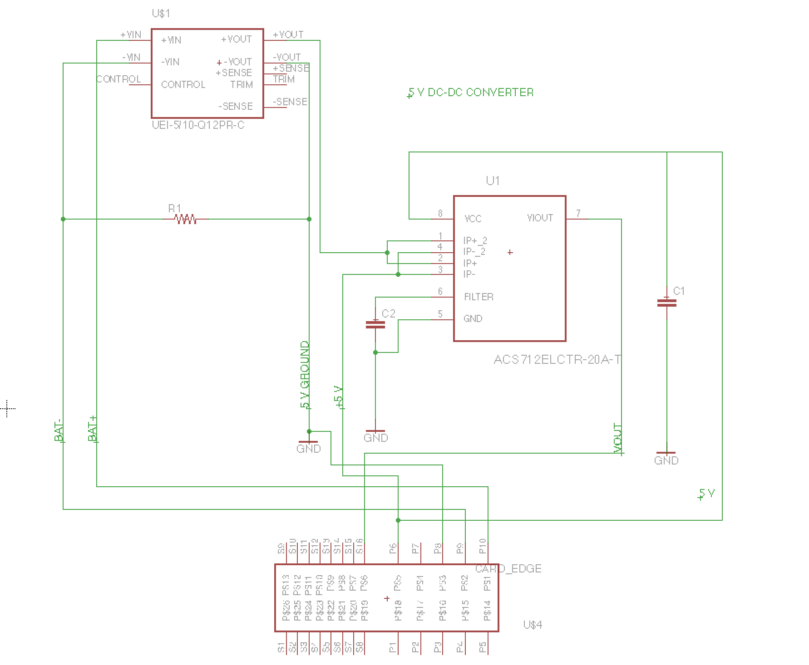
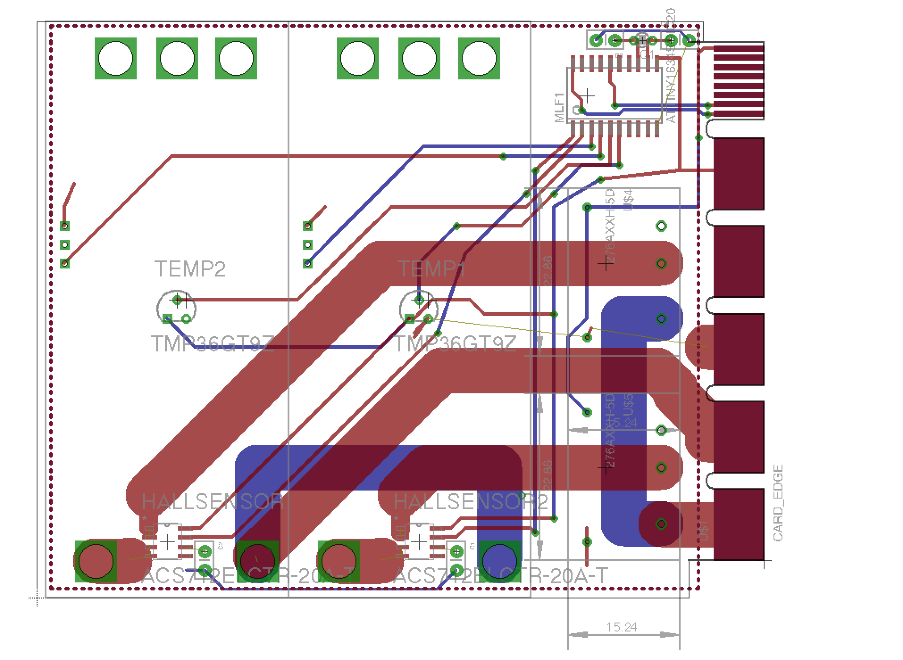

Backplane Electronics
=====================

.. note::
  Gravity does not apply to this element, it will stay in place of its own free will.

.. warning::
  Gravity applies to the following elements, push them in really really hard, or else.

5vdc
----

You had one job!

Overview
~~~~~~~~

Hardware
~~~~~~~~

Firmware
~~~~~~~~

Wiring
~~~~~~

12vdc
-----

Just to the backplane or to other things?

Overview
~~~~~~~~

Hardware
~~~~~~~~

Firmware
~~~~~~~~

Wiring
~~~~~~

ESC Controller
--------------

Overview
~~~~~~~~

===== ========
Board Thruster
===== ========
1     SwayFore
"     SwayAft
2     HeaveFP
"     HeaveFS
3     HeaveAP
"     HeaveAS
4     SurgeUL
"     SurgeUR
5     SurgeLL
"     SurgeLR
===== ========

Hardware
~~~~~~~~

Firmware
~~~~~~~~

Wiring
~~~~~~

Power Distribution
------------------

Overview
~~~~~~~~

- Battery Cables connect here?

Hardware
~~~~~~~~

Firmware
~~~~~~~~

Wiring
~~~~~~

Thruster Controller
-------------------

Overview
~~~~~~~~

The Boss!

Hardware
~~~~~~~~

Firmware
~~~~~~~~

Wiring
~~~~~~
